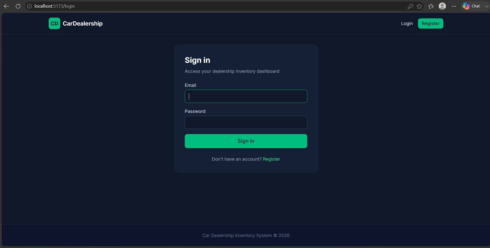
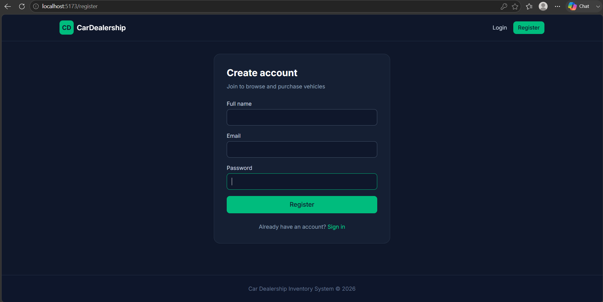
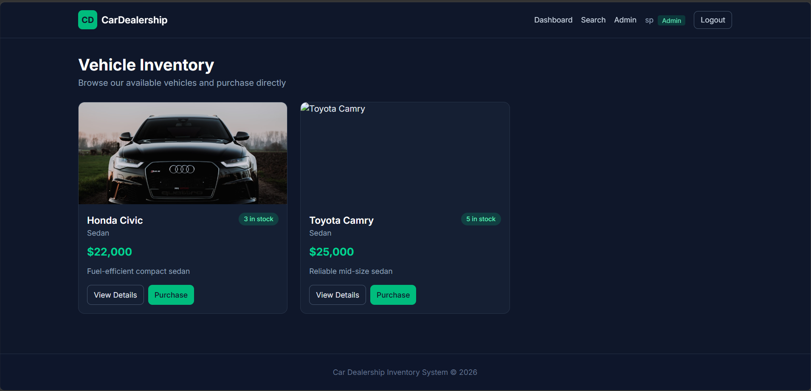
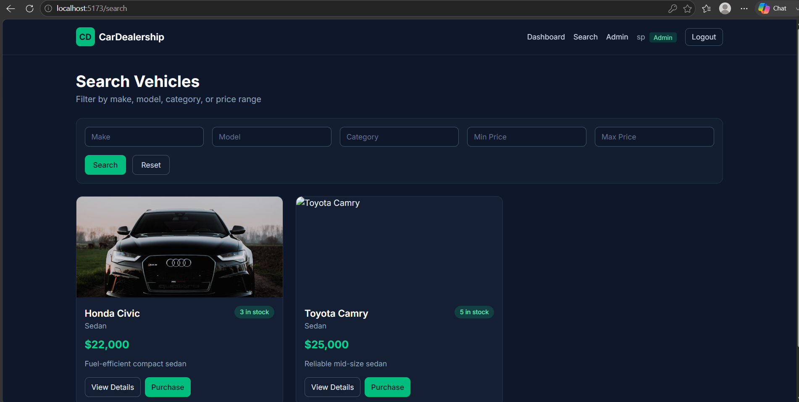
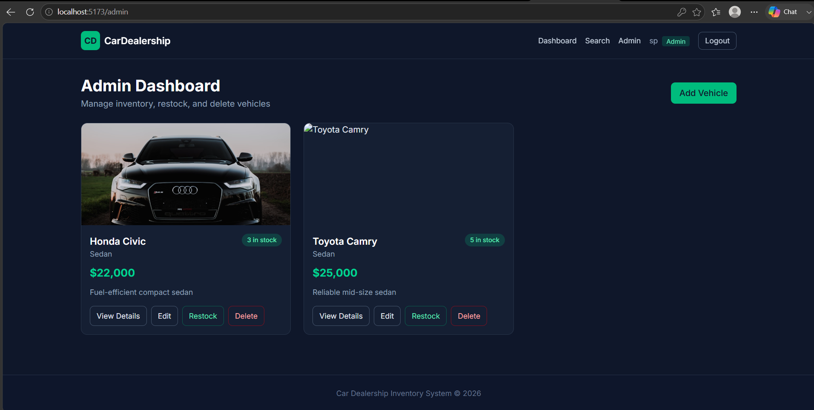

# Car Dealership Inventory System

A full-stack car dealership inventory management application built with the MERN stack. Users can browse, search, and purchase vehicles. Admins can manage inventory with full CRUD operations and restocking.

## Repository

**GitHub:** [github.com/Shreyas273/car-dealership-system](https://github.com/Shreyas273/car-dealership-system)

## Live Demo

| Service | Platform | URL |
|---------|----------|-----|
| Frontend | Vercel | _Deploy and add your URL here_ |
| Backend API | Render | _Deploy and add your URL here_ |
| Database | MongoDB Atlas | _Cloud-hosted MongoDB_ |

## Tech Stack

| Layer | Technology |
|-------|------------|
| Frontend | React 19 + Vite + Tailwind CSS |
| Backend | Node.js + Express 5 + TypeScript |
| Database | MongoDB + Mongoose |
| Auth | JWT + bcrypt |
| Testing | Jest + Supertest (TDD) |
| Deployment | Render (API) + Vercel (SPA) |

## Features

### User
- Register and login with JWT authentication
- Browse vehicle inventory dashboard
- Search and filter by make, model, category, and price range
- View vehicle details
- Purchase vehicles (button disabled when out of stock)

### Admin
- All user features
- Add, edit, and delete vehicles
- Restock inventory

## Project Structure

```
car-dealership-system/
├── backend/
│   ├── src/
│   │   ├── config/         # Database & env config
│   │   ├── controllers/    # HTTP request handlers
│   │   ├── middleware/     # Auth, admin, error handling
│   │   ├── models/         # Mongoose schemas
│   │   ├── repositories/   # Data access layer
│   │   ├── routes/         # API route definitions
│   │   ├── services/       # Business logic
│   │   ├── tests/          # Jest + Supertest suite
│   │   ├── app.ts
│   │   └── server.ts
│   └── package.json
├── frontend/
│   ├── src/
│   │   ├── api/            # Axios API clients
│   │   ├── components/     # Reusable UI components
│   │   ├── context/        # Auth context (React Context API)
│   │   ├── pages/          # Route pages
│   │   ├── routes/         # React Router config
│   │   └── App.tsx
│   └── package.json
├── render.yaml             # Render deployment blueprint
└── README.md
```

---

## Local Development

### Prerequisites

- Node.js 18+
- MongoDB (local or [MongoDB Atlas](https://www.mongodb.com/atlas))

### 1. Clone and setup

```bash
git clone <your-repo-url>
cd car-dealership-system
```

### 2. Backend

```bash
cd backend
cp .env.example .env
npm install
npm run dev
```

API runs at `http://localhost:5000`

Health check: `GET /api/health`

### 3. Frontend

```bash
cd frontend
cp .env.example .env
npm install
npm run dev
```

App runs at `http://localhost:5173` (proxies `/api` to backend)

### 4. Create an admin user

Register via the UI, then update role in MongoDB:

```js
db.users.updateOne({ email: "your@email.com" }, { $set: { role: "admin" } })
```

---

## API Reference

### Auth

| Method | Endpoint | Auth | Description |
|--------|----------|------|-------------|
| POST | `/api/auth/register` | No | Register a new user |
| POST | `/api/auth/login` | No | Login and receive JWT |
| GET | `/api/auth/me` | Yes | Get current user profile |

### Vehicles

| Method | Endpoint | Auth | Description |
|--------|----------|------|-------------|
| GET | `/api/vehicles` | Yes | List all vehicles |
| GET | `/api/vehicles/search` | Yes | Search by make, model, category, price |
| GET | `/api/vehicles/:id` | Yes | Get vehicle by ID |
| POST | `/api/vehicles` | Admin | Add a new vehicle |
| PUT | `/api/vehicles/:id` | Admin | Update a vehicle |
| DELETE | `/api/vehicles/:id` | Admin | Delete a vehicle |
| POST | `/api/vehicles/:id/purchase` | Yes | Purchase (decreases quantity) |
| POST | `/api/vehicles/:id/restock` | Admin | Restock inventory |

---

## Environment Variables

### Backend (`backend/.env`)

| Variable | Description | Example |
|----------|-------------|---------|
| `PORT` | Server port | `5000` |
| `NODE_ENV` | Environment | `development` |
| `MONGODB_URI` | MongoDB connection string | `mongodb+srv://...` |
| `JWT_SECRET` | JWT signing secret | `your-secret-key` |
| `JWT_EXPIRES_IN` | Token expiry | `7d` |
| `FRONTEND_URL` | Allowed CORS origin | `http://localhost:5173` |

### Frontend (`frontend/.env`)

| Variable | Description | Example |
|----------|-------------|---------|
| `VITE_API_URL` | Backend API URL | `http://localhost:5000` |

---

## Deployment

### Step 1: MongoDB Atlas

1. Create a free cluster at [mongodb.com/atlas](https://www.mongodb.com/atlas)
2. Create a database user with read/write access
3. Whitelist IP `0.0.0.0/0` (allow from anywhere) for cloud hosting
4. Copy the connection string → use as `MONGODB_URI`

### Step 2: Backend on Render

**Option A — Blueprint (recommended)**

1. Push your repo to GitHub
2. Go to [render.com](https://render.com) → **New** → **Blueprint**
3. Connect your repo — Render reads `render.yaml` automatically
4. Set these env vars manually in the dashboard:
   - `MONGODB_URI` — your Atlas connection string
   - `FRONTEND_URL` — your Vercel URL (set after Step 3)

**Option B — Manual**

1. **New** → **Web Service** → connect repo
2. Configure:
   - **Root Directory:** `backend`
   - **Build Command:** `npm install && npm run build`
   - **Start Command:** `npm start`
   - **Health Check Path:** `/api/health`
3. Add environment variables:

| Key | Value |
|-----|-------|
| `NODE_ENV` | `production` |
| `MONGODB_URI` | Atlas connection string |
| `JWT_SECRET` | Strong random secret |
| `JWT_EXPIRES_IN` | `7d` |
| `FRONTEND_URL` | `https://your-app.vercel.app` |

4. Deploy and copy your Render URL (e.g. `https://car-dealership-api.onrender.com`)

### Step 3: Frontend on Vercel

1. Go to [vercel.com](https://vercel.com) → **Add New Project**
2. Import your GitHub repo
3. Configure:
   - **Root Directory:** `frontend`
   - **Framework Preset:** Vite
   - **Build Command:** `npm run build`
   - **Output Directory:** `dist`
4. Add environment variable:

| Key | Value |
|-----|-------|
| `VITE_API_URL` | `https://your-render-app.onrender.com` |

5. Deploy and copy your Vercel URL

### Step 4: Finalize CORS

Go back to Render and update `FRONTEND_URL` to your exact Vercel URL, then redeploy the backend.

### Verify deployment

```bash
curl https://your-render-app.onrender.com/api/health
```

Expected response:
```json
{ "success": true, "message": "Car Dealership API is running" }
```

---

## Test Report

Run the backend test suite:

```bash
cd backend
npm test
```

Run with coverage:

```bash
npm run test:coverage
```

### Latest Results

```
Test Suites: 3 passed, 3 total
Tests:       38 passed, 38 total
```

| Suite | Tests | Coverage |
|-------|-------|----------|
| `auth.test.ts` | 13 | Register, login, JWT, authorization |
| `vehicle.test.ts` | 17 | CRUD, search, admin access |
| `inventory.test.ts` | 8 | Purchase, restock, stock validation |

### Coverage Summary

| Metric | Coverage |
|--------|----------|
| Statements | 92.88% |
| Branches | 78.43% |
| Functions | 97.82% |
| Lines | 92.33% |

---

## Screenshots

### Login Page


### Register Page


### Vehicle Dashboard


### Search Page


### Admin Dashboard


---

## Development Roadmap

- [x] Phase 1: Backend project setup
- [x] Phase 2: Authentication (JWT)
- [x] Phase 3: Vehicle CRUD & Inventory APIs
- [x] Phase 4: TDD test suite (backend)
- [x] Phase 5: React frontend
- [x] Phase 6: Deployment & documentation

---

## My AI Usage

### Tools Used

- **Cursor AI (Claude)** — Primary development assistant used throughout the project for architecture planning, code generation, debugging, and documentation.

### How I Used AI

| Phase | AI Contribution | My Contribution |
|-------|-----------------|-----------------|
| Planning | Recommended MERN tech stack, folder structure, API design, and TDD commit plan based on assignment PDF | Reviewed and approved architecture decisions |
| Phase 1 | Generated Express + TypeScript boilerplate, MongoDB config, Jest setup | Verified builds, tested health endpoint |
| Phase 2 | Wrote auth test suite first, then generated User model, AuthService, JWT middleware | Reviewed test cases, validated security patterns |
| Phase 3 | Wrote vehicle/inventory tests, implemented CRUD + search + purchase/restock APIs | Fixed Mongoose `model` field conflict, parallel test isolation |
| Phase 5 | Scaffolded React app, built all pages, components, routing, and Context API auth | Reviewed UX flow, verified purchase disabled when stock is 0 |
| Phase 6 | Created Render/Vercel configs, deployment docs, test report, this AI usage section | Will deploy manually and add live URLs + screenshots |

### Example AI-assisted workflow (TDD)

1. **Red** — AI wrote failing tests for `POST /api/auth/register`
2. **Green** — AI implemented `AuthService.register()` to pass tests
3. **Refactor** — I reviewed error handling and JWT payload structure

### Reflection

AI significantly accelerated boilerplate generation and test writing, letting me focus on architecture decisions and edge cases. The TDD approach worked well with AI — writing tests first gave clear targets for implementation. I manually verified all 38 tests pass, fixed TypeScript/Mongoose compatibility issues, and ensured the frontend correctly disables purchase when `quantity === 0`. AI is most effective when used as a pair-programming partner with human review, not as a substitute for understanding the code.

### Co-author Commit Example

When committing AI-assisted code, use this format:

```
feat: implement vehicle search API

Wrote search tests first, then implemented repository
filtering with regex and price range queries.

Co-authored-by: Cursor AI <AI@users.noreply.github.com>
```

---

## License

ISC
